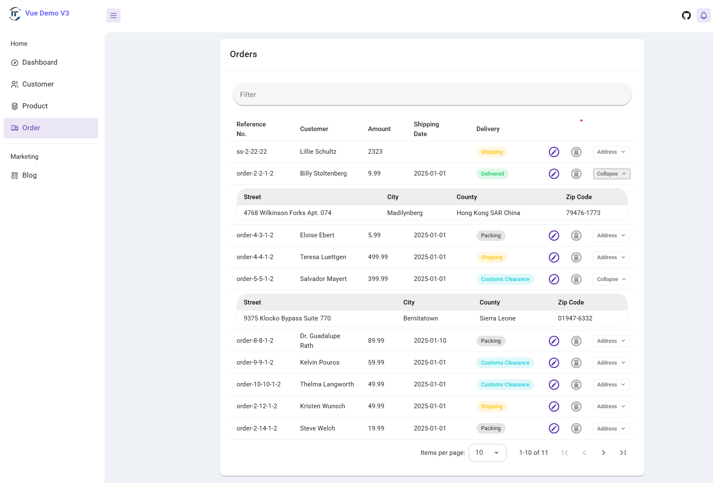
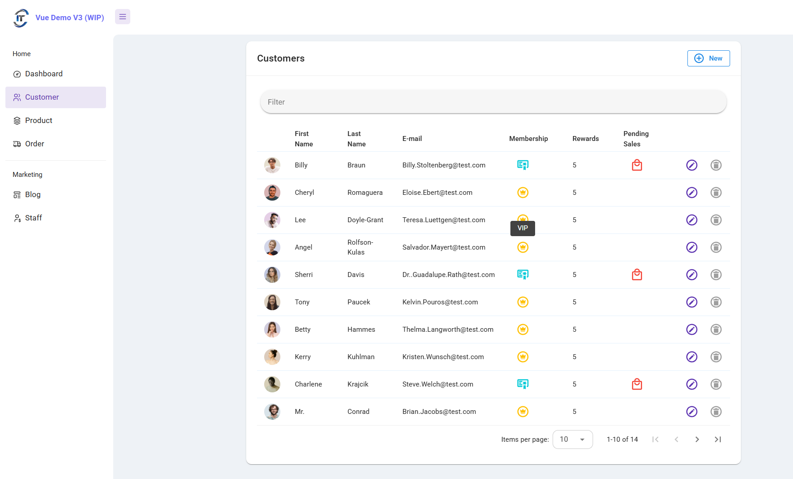
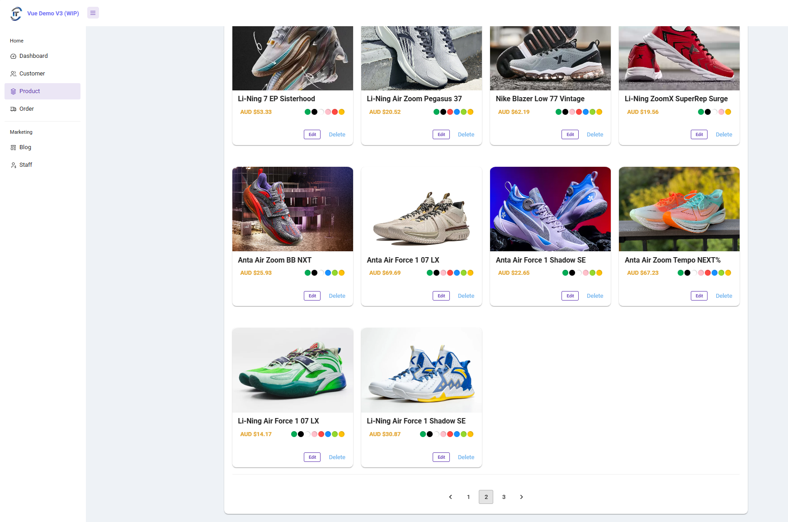
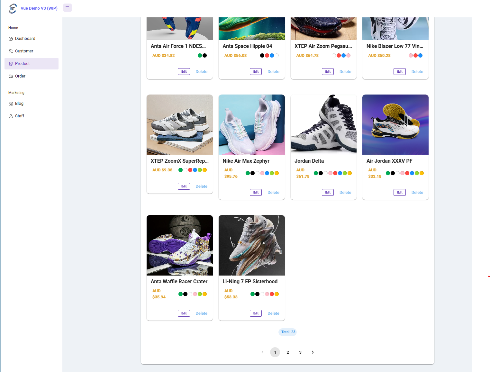
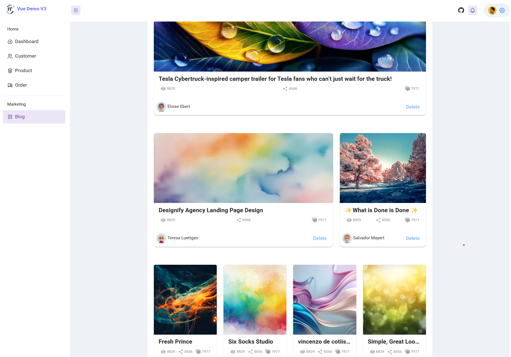
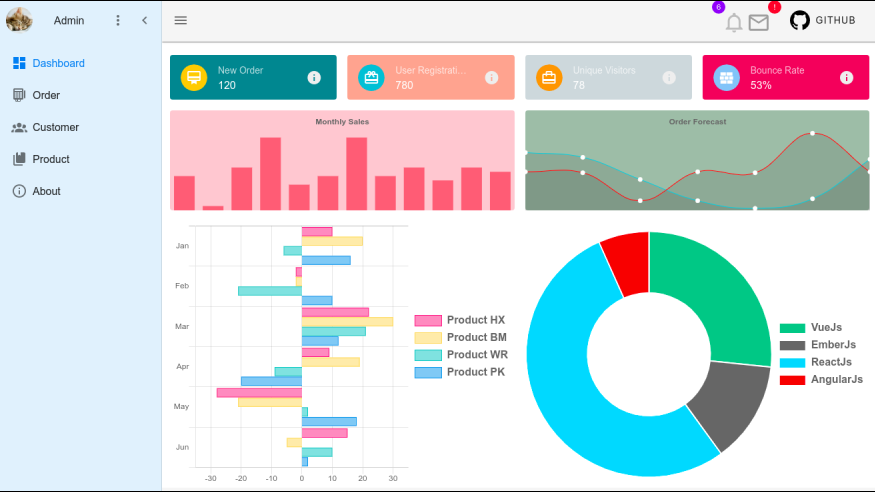
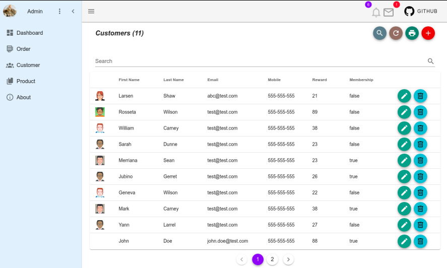

# Vue Demo App V3

> A reusable Vue.js starter project for real-world business based on Vue 3 with Vuetify 3 and Pinia.

The goal of this project is to build a reusable starter project for real-world business. To achieve this target, we need a solution which includes state management (Pinia), fake restful API and elegant UI design (Vuetify).


### Live Demo

[Latest Demo App](https://vue-app-demo.harryho.org):  The demo is just a proof of concept. It doesn't have back-end API and all features of master branch.

[Previous version Demo App](https://vue-demo-v2.harryho.org):  The demo is just a proof of concept. It doesn't have back-end API and all features of master branch. Source code is availabe on a different [branch](https://github.com/harryho/vue-crm/tree/v2-vtf2)


### Screenshots

#### Latest Version

<!--  -->
<!--  -->

<!--  -->



#### Previous Version






<!-- 

 -->

## Build Setup

``` bash

# Clone project
git clone https://github.com/harryho/vue-crm.git


# install dependences for Vue 2 CRM
cd vue-crm
npm install 


# serve with hot reload at localhost:8080
npm run dev


```

## Docker 


```bash
## Run / Test release without building new image
npm run build

# Launch nginx image to test latest release
docker pull nginx:alpine
docker run -p 8080:80 -v \
    <your_aboslute_path>/dist:/usr/share/nginx/html nginx:alpine


# Build release image
docker build . -t  vue-demo:3.0

# Launch the development image in the backgroud
docker run --rm -d --publish 8080:80  --name vd3 vue-demo:3.0

# Check the log
docker logs vd3   -f

```


For detailed explanation on how things work, checkout following links

* [vue](https://vuex.vuejs.org/en/)
* [vuetifyjs](https://dev.vuetifyjs.com/)
* [Pinia](https://pinia.vuejs.org/)


#### Change log

*  Dec 2024 - Uplift to Vue 3 + Vuetify 3

* 2 May 2020 - Merge the branch vuetify-ts to master

    After the merge, the whole project moved to new techncial stack - TypeScript. Also, the VuetifyJs is upgraded to 2.x version. 


*  6 Dec 2018 - Create an archived branch json-server

    This branch was the master which used Json-Server as fake API. Considering the hiccup of setting Json-Server up and maintenance, it will be replaced by fake service ( Readonly fake API). You still can find and clone this branch with the name __json-server__, but it is no longer updated. It is an archived branch.


*  27 May 2018 - Rebase demo branch to master

    New master doesn't rely on Json-Server as fake API. It will only have Readonly fake API. It means any new or updated data will be stored to any physical file. All test data will be rolled back after system restart.


