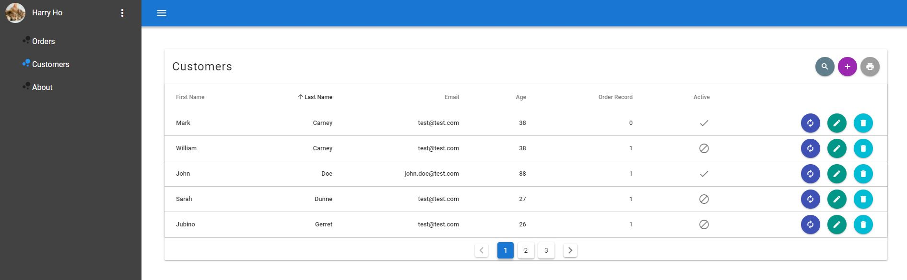

# Vue 2 CRM

> A simple Vue.js CRM project based on Vue 2 PWA template with Vuetify. 

* This starter project is built-in with Vue 2 PWA from scratch.
* The UI is built on the top of Vuetify
* It uses Vuex, Axios as well to manage authentication. (Dummy token)
* It uses vue-chartjs to create charts on dashboard
* It uses Json-Server as fake Restful API. (You can simple replace it with your own API)

#### Screenshots





## Build Setup

``` bash

# Clone project
git clone https://github.com/harryho/vue2crm.git


# prepare Json-Server as fake Restful API

## clone json-server to folder server
cd vue2crm
git clone https://github.com/typicode/json-server.git server
cd server
npm install json-server

## replace db.json and routes.json files
copy /Y ..\db\*.json

## start json-server
json-server -p 5354 db.json

## You will see the following output. You can test the URLs via browser.
##
## \{^_^}/ hi!                        
##                                    
## Loading db.json                    
## Done                               
##                                    
## Resources                          
## http://localhost:5354/token        
## http://localhost:5354/customers    
## http://localhost:5354/orders       
##                                    
## Home                               
## http://localhost:5354              

# install dependences for Vue 2 CRM
cd ..
npm install

# serve with hot reload at localhost:8080
npm run dev

```

For detailed explanation on how things work, checkout following links

* [vuex](https://vuex.vuejs.org/en/)
* [vuetify](https://vuetifyjs.com/)
* [axios](https://github.com/mzabriskie/axios/)
* [vue-chartjs](https://github.com/apertureless/vue-chartjs)
* [webpack guide](http://vuejs-templates.github.io/webpack/) 
* [vue-loader](http://vuejs.github.io/vue-loader).
